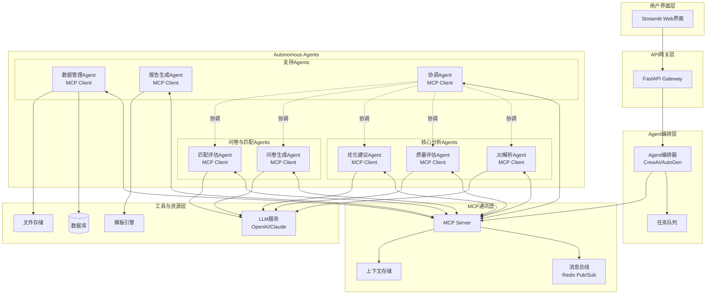
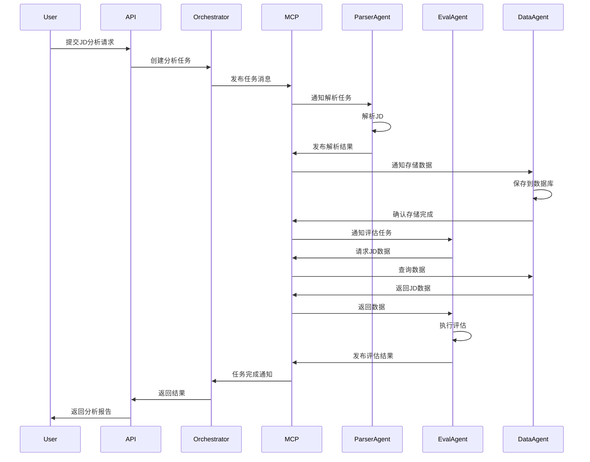
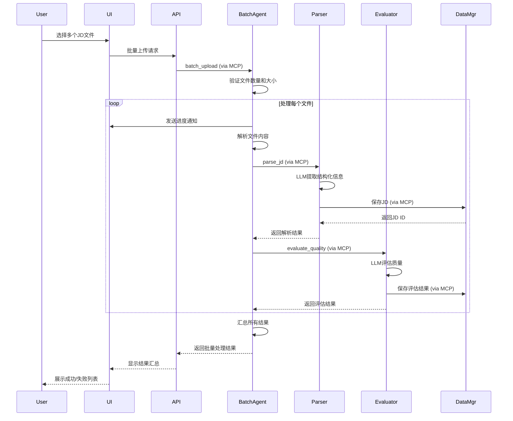
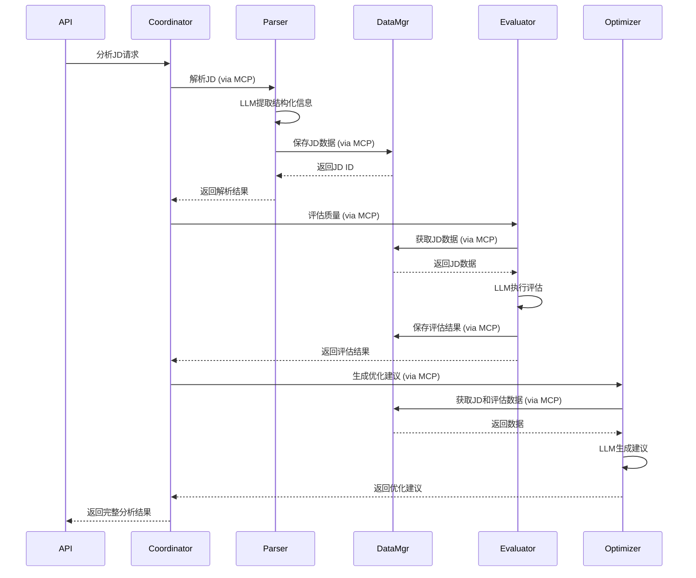

# 岗位JD分析器 - 设计文档

## 概述

岗位JD分析器是一个基于Agentic AI架构的智能系统，采用多Agent协作模式，通过MCP（Model Context Protocol）实现Agent间的标准化通讯。系统将复杂的HR分析任务分解为多个自主Agent，每个Agent专注于特定领域，通过MCP协议进行信息交换和协作，实现岗位JD的解析、评估、优化和候选人匹配。

### 技术栈

- **Agent框架**: AutoGen / CrewAI（多Agent编排）
- **通讯协议**: MCP（Model Context Protocol）
- **LLM引擎**: DeepSeek-R1（推理模型）
- **后端框架**: FastAPI（Python 3.11+）
- **数据存储**: SQLite（MVP）
- **消息队列**: Redis（Agent消息传递）
- **文档处理**: python-docx, PyPDF2, pdfplumber
- **数据验证**: Pydantic
- **前端**: Streamlit（MVP快速原型）

## 架构设计

### Agentic AI架构概述

系统采用多Agent协作架构，每个Agent是一个自主的智能实体，具有：
- **自主性**: 独立决策和执行任务
- **反应性**: 感知环境变化并做出响应
- **社交性**: 通过MCP协议与其他Agent通讯
- **目标导向**: 专注于特定的HR分析任务

### 系统架构图



### MCP通讯架构



### 核心组件

#### 1. MCP通讯协议实现

MCP（Model Context Protocol）是Agent间通讯的标准协议，提供：
- 标准化的消息格式
- 上下文共享机制
- 工具调用接口
- 资源访问控制

```python
from typing import Dict, Any, List, Optional
from pydantic import BaseModel
import asyncio
import json

class MCPMessage(BaseModel):
    """MCP标准消息格式"""
    message_id: str
    sender: str  # Agent ID
    receiver: Optional[str]  # 目标Agent ID，None表示广播
    message_type: str  # request, response, notification, event
    action: str  # 操作类型
    payload: Dict[str, Any]
    context_id: Optional[str]  # 上下文ID
    timestamp: float

class MCPContext(BaseModel):
    """MCP共享上下文"""
    context_id: str
    task_id: str
    shared_data: Dict[str, Any]
    metadata: Dict[str, Any]

class MCPServer:
    """MCP服务器 - Agent通讯中枢"""
    
    def __init__(self, redis_client):
        self.redis = redis_client
        self.agents: Dict[str, 'MCPAgent'] = {}
        self.contexts: Dict[str, MCPContext] = {}
    
    async def register_agent(self, agent: 'MCPAgent'):
        """注册Agent"""
        self.agents[agent.agent_id] = agent
        await self.redis.sadd("mcp:agents", agent.agent_id)
    
    async def send_message(self, message: MCPMessage):
        """发送消息"""
        if message.receiver:
            # 点对点消息
            channel = f"mcp:agent:{message.receiver}"
        else:
            # 广播消息
            channel = "mcp:broadcast"
        
        await self.redis.publish(channel, message.json())
    
    async def get_context(self, context_id: str) -> Optional[MCPContext]:
        """获取共享上下文"""
        data = await self.redis.get(f"mcp:context:{context_id}")
        if data:
            return MCPContext.parse_raw(data)
        return None
    
    async def update_context(self, context: MCPContext):
        """更新共享上下文"""
        await self.redis.set(
            f"mcp:context:{context.context_id}",
            context.json(),
            ex=3600  # 1小时过期
        )

class MCPAgent:
    """MCP Agent基类 - 所有Agent的基础"""
    
    def __init__(
        self,
        agent_id: str,
        agent_type: str,
        mcp_server: MCPServer,
        llm_client: Any  # DeepSeek-R1 client
    ):
        self.agent_id = agent_id
        self.agent_type = agent_type
        self.mcp_server = mcp_server
        self.llm = llm_client  # DeepSeek-R1推理模型
        self.tools: List[callable] = []
        self.message_handlers: Dict[str, callable] = {}
    
    async def start(self):
        """启动Agent"""
        await self.mcp_server.register_agent(self)
        await self._subscribe_to_messages()
    
    async def _subscribe_to_messages(self):
        """订阅消息"""
        pubsub = self.mcp_server.redis.pubsub()
        await pubsub.subscribe(
            f"mcp:agent:{self.agent_id}",
            "mcp:broadcast"
        )
        
        async for message in pubsub.listen():
            if message['type'] == 'message':
                await self._handle_message(
                    MCPMessage.parse_raw(message['data'])
                )
    
    async def _handle_message(self, message: MCPMessage):
        """处理接收到的消息"""
        handler = self.message_handlers.get(message.action)
        if handler:
            await handler(message)
    
    async def send_request(
        self,
        receiver: str,
        action: str,
        payload: Dict[str, Any],
        context_id: Optional[str] = None
    ) -> MCPMessage:
        """发送请求并等待响应"""
        message = MCPMessage(
            message_id=generate_id(),
            sender=self.agent_id,
            receiver=receiver,
            message_type="request",
            action=action,
            payload=payload,
            context_id=context_id,
            timestamp=time.time()
        )
        
        await self.mcp_server.send_message(message)
        
        # 等待响应（简化版，实际需要更复杂的响应匹配机制）
        return await self._wait_for_response(message.message_id)
    
    async def send_notification(
        self,
        action: str,
        payload: Dict[str, Any],
        context_id: Optional[str] = None
    ):
        """发送通知（不需要响应）"""
        message = MCPMessage(
            message_id=generate_id(),
            sender=self.agent_id,
            receiver=None,  # 广播
            message_type="notification",
            action=action,
            payload=payload,
            context_id=context_id,
            timestamp=time.time()
        )
        
        await self.mcp_server.send_message(message)
    
    def register_tool(self, tool: callable):
        """注册工具"""
        self.tools.append(tool)
    
    def register_handler(self, action: str, handler: callable):
        """注册消息处理器"""
        self.message_handlers[action] = handler
```

#### 2. 专门化Agent实现

**Agent类型及职责：**

##### 2.1 协调Agent（CoordinatorAgent）
- 任务分解和分配
- Agent间协作编排
- 工作流管理

```python
class CoordinatorAgent(MCPAgent):
    """协调Agent - 负责任务编排"""
    
    def __init__(self, mcp_server: MCPServer, llm_client):
        super().__init__(
            agent_id="coordinator",
            agent_type="coordinator",
            mcp_server=mcp_server,
            llm_client=llm_client
        )
        
        # 注册消息处理器
        self.register_handler("analyze_jd", self.handle_analyze_jd)
        self.register_handler("generate_questionnaire", self.handle_generate_questionnaire)
        self.register_handler("evaluate_match", self.handle_evaluate_match)
    
    async def handle_analyze_jd(self, message: MCPMessage):
        """处理JD分析请求"""
        jd_text = message.payload.get("jd_text")
        context_id = message.context_id or generate_id()
        
        # 创建共享上下文
        context = MCPContext(
            context_id=context_id,
            task_id=message.message_id,
            shared_data={"jd_text": jd_text},
            metadata={"workflow": "jd_analysis"}
        )
        await self.mcp_server.update_context(context)
        
        # 1. 请求解析Agent解析JD
        parse_response = await self.send_request(
            receiver="parser",
            action="parse_jd",
            payload={"jd_text": jd_text},
            context_id=context_id
        )
        
        # 2. 请求评估Agent评估质量
        eval_response = await self.send_request(
            receiver="evaluator",
            action="evaluate_quality",
            payload={"jd_id": parse_response.payload["jd_id"]},
            context_id=context_id
        )
        
        # 3. 请求优化Agent生成建议
        opt_response = await self.send_request(
            receiver="optimizer",
            action="generate_suggestions",
            payload={"jd_id": parse_response.payload["jd_id"]},
            context_id=context_id
        )
        
        # 4. 汇总结果
        result = {
            "jd": parse_response.payload,
            "evaluation": eval_response.payload,
            "suggestions": opt_response.payload
        }
        
        # 5. 返回响应
        await self.send_response(message, result)
```

##### 2.2 JD解析Agent（ParserAgent）
- 提取JD结构化信息
- 应用自定义解析模板
- 数据验证和清洗

```python
class ParserAgent(MCPAgent):
    """JD解析Agent"""
    
    def __init__(self, mcp_server: MCPServer, llm_client):
        super().__init__(
            agent_id="parser",
            agent_type="parser",
            mcp_server=mcp_server,
            llm_client=llm_client
        )
        
        self.register_handler("parse_jd", self.handle_parse_jd)
        self.register_handler("classify_job", self.handle_classify_job)
    
    async def handle_parse_jd(self, message: MCPMessage):
        """处理JD解析请求"""
        jd_text = message.payload.get("jd_text")
        custom_fields = message.payload.get("custom_fields", {})
        
        # 使用LLM解析JD
        prompt = self._build_parse_prompt(jd_text, custom_fields)
        parsed_data = await self._call_llm(prompt)
        
        # 自动分类职位
        category_ids = await self._classify_job(parsed_data, message.context_id)
        parsed_data.update(category_ids)
        
        # 请求数据Agent保存
        save_response = await self.send_request(
            receiver="data_manager",
            action="save_jd",
            payload=parsed_data,
            context_id=message.context_id
        )
        
        # 返回结果
        await self.send_response(message, {
            "jd_id": save_response.payload["jd_id"],
            "parsed_data": parsed_data
        })
    
    async def handle_classify_job(self, message: MCPMessage):
        """处理职位分类请求"""
        jd_data = message.payload.get("jd_data")
        category_ids = await self._classify_job(jd_data, message.context_id)
        await self.send_response(message, category_ids)
    
    async def _classify_job(self, jd_data: Dict, context_id: str) -> Dict:
        """自动分类职位到3层级分类体系"""
        # 获取所有分类
        categories_response = await self.send_request(
            receiver="data_manager",
            action="get_all_categories",
            payload={},
            context_id=context_id
        )
        
        categories = categories_response.payload["categories"]
        
        # 获取样本JD（用于提高分类准确性）
        sample_jds = await self._get_sample_jds(categories, context_id)
        
        # 使用LLM进行分类
        prompt = self._build_classification_prompt(jd_data, categories, sample_jds)
        classification = await self._call_llm(prompt)
        
        return {
            "category_level1_id": classification.get("level1_id"),
            "category_level2_id": classification.get("level2_id"),
            "category_level3_id": classification.get("level3_id")
        }
    
    async def _get_sample_jds(self, categories: List[Dict], context_id: str) -> Dict:
        """获取各分类的样本JD"""
        sample_jds = {}
        
        for category in categories:
            if category["level"] == 3 and category.get("sample_jd_ids"):
                # 获取样本JD内容
                for jd_id in category["sample_jd_ids"]:
                    jd_response = await self.send_request(
                        receiver="data_manager",
                        action="get_jd",
                        payload={"jd_id": jd_id},
                        context_id=context_id
                    )
                    if category["id"] not in sample_jds:
                        sample_jds[category["id"]] = []
                    sample_jds[category["id"]].append(jd_response.payload["jd"])
        
        return sample_jds
    
    def _build_parse_prompt(self, jd_text: str, custom_fields: Dict) -> str:
        """构建解析Prompt"""
        return f"""
        你是一个专业的HR岗位分析专家。请解析以下岗位JD。
        
        岗位JD:
        {jd_text}
        
        自定义字段: {json.dumps(custom_fields, ensure_ascii=False)}
        
        请以JSON格式返回结构化数据。
        """
    
    def _build_classification_prompt(
        self, 
        jd_data: Dict, 
        categories: List[Dict],
        sample_jds: Dict[str, List[Dict]]
    ) -> str:
        """构建分类Prompt"""
        prompt = f"""
        请将以下职位归类到合适的分类中。
        
        职位信息:
        {json.dumps(jd_data, ensure_ascii=False)}
        
        可用分类（3层级）:
        {json.dumps(categories, ensure_ascii=False)}
        """
        
        # 添加样本JD作为参考
        if sample_jds:
            prompt += "\n\n参考样本职位JD（用于提高分类准确性）:\n"
            for category_id, samples in sample_jds.items():
                category_name = next((c["name"] for c in categories if c["id"] == category_id), "")
                prompt += f"\n分类 '{category_name}' 的样本:\n"
                for idx, sample in enumerate(samples, 1):
                    prompt += f"样本{idx}: {json.dumps(sample, ensure_ascii=False)}\n"
        
        prompt += """
        
        请返回JSON格式：
        {
            "level1_id": "一级分类ID",
            "level2_id": "二级分类ID",
            "level3_id": "三级分类ID",
            "reasoning": "分类理由"
        }
        """
        
        return prompt
    
    async def _call_llm(self, prompt: str) -> Dict:
        """调用DeepSeek-R1"""
        response = await self.llm.generate(
            prompt,
            model="deepseek-reasoner"  # DeepSeek-R1推理模型
        )
        return json.loads(response)
```

##### 2.3 质量评估Agent（EvaluatorAgent）
- 评估JD质量
- 应用专业评估模型（美世法、因素法）
- 识别质量问题

```python
class EvaluatorAgent(MCPAgent):
    """质量评估Agent - 支持综合评估"""
    
    def __init__(self, mcp_server: MCPServer, llm_client):
        super().__init__(
            agent_id="evaluator",
            agent_type="evaluator",
            mcp_server=mcp_server,
            llm_client=llm_client
        )
        
        self.register_handler("evaluate_quality", self.handle_evaluate_quality)
        self.register_handler("update_evaluation", self.handle_update_evaluation)
        self.evaluation_models = {
            "standard": StandardEvaluationModel(),
            "mercer_ipe": MercerIPEModel(),
            "factor_comparison": FactorComparisonModel()
        }
        self.comprehensive_evaluator = ComprehensiveEvaluator(llm_client)
    
    async def handle_evaluate_quality(self, message: MCPMessage):
        """处理质量评估请求 - 综合三个维度"""
        jd_id = message.payload.get("jd_id")
        model_type = message.payload.get("model_type", "standard")
        category_level3_id = message.payload.get("category_level3_id")
        
        # 从数据Agent获取JD数据
        jd_response = await self.send_request(
            receiver="data_manager",
            action="get_jd",
            payload={"jd_id": jd_id},
            context_id=message.context_id
        )
        
        jd_data = jd_response.payload["jd"]
        
        # 获取分类标签（如果有第三层级分类）
        category_tags = []
        if category_level3_id:
            tags_response = await self.send_request(
                receiver="data_manager",
                action="get_category_tags",
                payload={"category_id": category_level3_id},
                context_id=message.context_id
            )
            category_tags = tags_response.payload.get("tags", [])
        
        # 选择评估模型
        model = self.evaluation_models[model_type]
        
        # 执行综合评估（整合三个维度）
        evaluation_result = await self.comprehensive_evaluator.comprehensive_evaluate(
            jd_data,
            model,
            category_tags
        )
        
        # 添加元数据
        evaluation_result["jd_id"] = jd_id
        evaluation_result["model_type"] = model_type
        evaluation_result["is_manually_modified"] = False
        evaluation_result["manual_modifications"] = []
        
        # 保存评估结果
        await self.send_request(
            receiver="data_manager",
            action="save_evaluation",
            payload={
                "jd_id": jd_id,
                "evaluation": evaluation_result
            },
            context_id=message.context_id
        )
        
        # 返回结果
        await self.send_response(message, evaluation_result)
    
    async def handle_update_evaluation(self, message: MCPMessage):
        """处理手动修改评估结果的请求"""
        jd_id = message.payload.get("jd_id")
        modifications = message.payload.get("modifications", {})
        reason = message.payload.get("reason", "")
        
        # 获取现有评估结果
        eval_response = await self.send_request(
            receiver="data_manager",
            action="get_evaluation",
            payload={"jd_id": jd_id},
            context_id=message.context_id
        )
        
        evaluation = eval_response.payload["evaluation"]
        
        # 记录修改历史
        modification_record = {
            "timestamp": time.time(),
            "modified_fields": modifications,
            "reason": reason,
            "original_values": {}
        }
        
        # 应用修改并记录原始值
        for field, new_value in modifications.items():
            if field in evaluation:
                modification_record["original_values"][field] = evaluation[field]
                evaluation[field] = new_value
        
        # 标记为手动修改
        evaluation["is_manually_modified"] = True
        evaluation["manual_modifications"].append(modification_record)
        evaluation["updated_at"] = datetime.now()
        
        # 保存更新后的评估结果
        await self.send_request(
            receiver="data_manager",
            action="save_evaluation",
            payload={
                "jd_id": jd_id,
                "evaluation": evaluation
            },
            context_id=message.context_id
        )
        
        # 返回结果
        await self.send_response(message, {
            "success": True,
            "evaluation": evaluation
        })
```

##### 2.4 优化建议Agent（OptimizerAgent）
- 生成JD优化建议
- 提供改写示例
- 识别缺失信息

##### 2.5 问卷生成Agent（QuestionnaireAgent）
- 基于JD生成评估问卷
- 适配不同评估模型
- 自定义问卷配置

##### 2.6 匹配评估Agent（MatcherAgent）
- 计算候选人匹配度
- 多维度评分
- 生成优势和差距分析

##### 2.7 数据管理Agent（DataManagerAgent）
- 统一数据访问接口
- 数据持久化
- 缓存管理

```python
class DataManagerAgent(MCPAgent):
    """数据管理Agent - 支持企业、分类和标签管理"""
    
    def __init__(self, mcp_server: MCPServer, db_client):
        super().__init__(
            agent_id="data_manager",
            agent_type="data_manager",
            mcp_server=mcp_server,
            llm_client=None  # 不需要LLM
        )
        
        self.db = db_client
        
        # JD相关
        self.register_handler("save_jd", self.handle_save_jd)
        self.register_handler("get_jd", self.handle_get_jd)
        
        # 评估相关
        self.register_handler("save_evaluation", self.handle_save_evaluation)
        self.register_handler("get_evaluation", self.handle_get_evaluation)
        
        # 企业相关
        self.register_handler("save_company", self.handle_save_company)
        self.register_handler("get_company", self.handle_get_company)
        self.register_handler("get_all_companies", self.handle_get_all_companies)
        self.register_handler("delete_company", self.handle_delete_company)
        
        # 分类相关
        self.register_handler("save_category", self.handle_save_category)
        self.register_handler("get_all_categories", self.handle_get_all_categories)
        self.register_handler("get_company_categories", self.handle_get_company_categories)
        self.register_handler("update_jd_category", self.handle_update_jd_category)
        
        # 标签相关
        self.register_handler("save_category_tag", self.handle_save_category_tag)
        self.register_handler("get_category_tags", self.handle_get_category_tags)
        self.register_handler("delete_category_tag", self.handle_delete_category_tag)
        
        # 其他
        self.register_handler("save_questionnaire", self.handle_save_questionnaire)
        self.register_handler("save_match_result", self.handle_save_match_result)
    
    async def handle_save_jd(self, message: MCPMessage):
        """保存JD数据"""
        jd_data = message.payload
        jd_id = await self.db.insert_jd(jd_data)
        
        await self.send_response(message, {"jd_id": jd_id})
    
    async def handle_get_jd(self, message: MCPMessage):
        """获取JD数据"""
        jd_id = message.payload.get("jd_id")
        jd_data = await self.db.get_jd(jd_id)
        
        # 如果有第三层级分类，获取关联的标签
        if jd_data.get("category_level3_id"):
            tags = await self.db.get_category_tags(jd_data["category_level3_id"])
            jd_data["category_tags"] = tags
        
        await self.send_response(message, {"jd": jd_data})
    
    async def handle_save_evaluation(self, message: MCPMessage):
        """保存评估结果"""
        jd_id = message.payload.get("jd_id")
        evaluation = message.payload.get("evaluation")
        await self.db.save_evaluation(jd_id, evaluation)
        await self.send_response(message, {"success": True})
    
    async def handle_get_evaluation(self, message: MCPMessage):
        """获取评估结果"""
        jd_id = message.payload.get("jd_id")
        evaluation = await self.db.get_evaluation(jd_id)
        await self.send_response(message, {"evaluation": evaluation})
    
    async def handle_save_company(self, message: MCPMessage):
        """保存企业"""
        company_data = message.payload
        company_id = await self.db.insert_company(company_data)
        await self.send_response(message, {"company_id": company_id})
    
    async def handle_get_company(self, message: MCPMessage):
        """获取企业"""
        company_id = message.payload.get("company_id")
        company = await self.db.get_company(company_id)
        await self.send_response(message, {"company": company})
    
    async def handle_get_all_companies(self, message: MCPMessage):
        """获取所有企业"""
        companies = await self.db.get_all_companies()
        await self.send_response(message, {"companies": companies})
    
    async def handle_delete_company(self, message: MCPMessage):
        """删除企业"""
        company_id = message.payload.get("company_id")
        await self.db.delete_company(company_id)
        await self.send_response(message, {"success": True})
    
    async def handle_get_all_categories(self, message: MCPMessage):
        """获取所有职位分类"""
        categories = await self.db.get_all_categories()
        await self.send_response(message, {"categories": categories})
    
    async def handle_get_company_categories(self, message: MCPMessage):
        """获取企业的职位分类"""
        company_id = message.payload.get("company_id")
        categories = await self.db.get_company_categories(company_id)
        await self.send_response(message, {"categories": categories})
    
    async def handle_save_category(self, message: MCPMessage):
        """保存职位分类"""
        category_data = message.payload
        category_id = await self.db.insert_category(category_data)
        await self.send_response(message, {"category_id": category_id})
    
    async def handle_update_jd_category(self, message: MCPMessage):
        """更新JD的分类"""
        jd_id = message.payload.get("jd_id")
        category_ids = message.payload.get("category_ids")
        await self.db.update_jd_category(jd_id, category_ids)
        await self.send_response(message, {"success": True})
    
    async def handle_save_category_tag(self, message: MCPMessage):
        """保存分类标签"""
        tag_data = message.payload
        tag_id = await self.db.insert_category_tag(tag_data)
        await self.send_response(message, {"tag_id": tag_id})
    
    async def handle_get_category_tags(self, message: MCPMessage):
        """获取分类的所有标签"""
        category_id = message.payload.get("category_id")
        tags = await self.db.get_category_tags(category_id)
        await self.send_response(message, {"tags": tags})
    
    async def handle_delete_category_tag(self, message: MCPMessage):
        """删除分类标签"""
        tag_id = message.payload.get("tag_id")
        await self.db.delete_category_tag(tag_id)
        await self.send_response(message, {"success": True})
```

##### 2.8 报告生成Agent（ReportAgent）
- 生成分析报告
- 多格式导出
- 可视化图表

#### 3. Agent编排与工作流

使用CrewAI或AutoGen进行Agent编排：

```python
from crewai import Crew, Task, Agent as CrewAgent

class JDAnalysisCrew:
    """JD分析Agent团队"""
    
    def __init__(self, mcp_server: MCPServer):
        self.mcp_server = mcp_server
        self.agents = self._create_agents()
        self.crew = self._create_crew()
    
    def _create_agents(self):
        """创建Agent团队"""
        return {
            "coordinator": CoordinatorAgent(self.mcp_server, llm_client),
            "parser": ParserAgent(self.mcp_server, llm_client),
            "evaluator": EvaluatorAgent(self.mcp_server, llm_client),
            "optimizer": OptimizerAgent(self.mcp_server, llm_client),
            "questionnaire": QuestionnaireAgent(self.mcp_server, llm_client),
            "matcher": MatcherAgent(self.mcp_server, llm_client),
            "data_manager": DataManagerAgent(self.mcp_server, db_client),
            "reporter": ReportAgent(self.mcp_server, template_engine)
        }
    
    def _create_crew(self):
        """创建Crew编排"""
        return Crew(
            agents=list(self.agents.values()),
            tasks=[],
            process="sequential"  # 或 "hierarchical"
        )
    
    async def analyze_jd(self, jd_text: str, options: Dict) -> Dict:
        """执行JD分析工作流"""
        # 创建任务
        task = Task(
            description=f"分析岗位JD: {jd_text[:100]}...",
            agent=self.agents["coordinator"],
            expected_output="完整的JD分析报告"
        )
        
        # 执行任务
        result = await self.crew.kickoff(task)
        
        return result
```

## 数据模型

### 核心实体

```python
from pydantic import BaseModel, Field
from typing import List, Dict, Optional
from datetime import datetime
from enum import Enum

class EvaluationModel(str, Enum):
    """评估模型类型"""
    STANDARD = "standard"  # 标准评估
    MERCER_IPE = "mercer_ipe"  # 美世国际职位评估法
    FACTOR_COMPARISON = "factor_comparison"  # 因素比较法

class Company(BaseModel):
    """企业模型"""
    id: str
    name: str
    created_at: datetime
    updated_at: datetime

class CategoryTag(BaseModel):
    """分类标签模型（仅用于第三层级分类）"""
    id: str
    category_id: str  # 所属分类ID（必须是第三层级）
    name: str
    tag_type: str  # 战略重要性、业务价值、技能稀缺性、市场竞争度、发展潜力、风险等级
    description: str  # 标签描述和对评估的影响说明
    created_at: datetime

class JobCategory(BaseModel):
    """职位分类模型（支持3层级）"""
    id: str
    company_id: str  # 所属企业ID
    name: str
    level: int = Field(ge=1, le=3)  # 1=一级, 2=二级, 3=三级
    parent_id: Optional[str]  # 父级分类ID
    description: Optional[str]
    # 标签（仅第三层级）
    tags: List[CategoryTag] = []
    created_at: datetime
    updated_at: datetime

class JobDescription(BaseModel):
    """岗位JD模型"""
    id: str
    job_title: str
    department: Optional[str]
    location: Optional[str]
    responsibilities: List[str]
    required_skills: List[str]
    preferred_skills: List[str]
    qualifications: List[str]
    custom_fields: Dict[str, any] = {}
    raw_text: str
    # 职位分类（最多3层）
    category_level1_id: Optional[str]  # 一级分类
    category_level2_id: Optional[str]  # 二级分类
    category_level3_id: Optional[str]  # 三级分类
    # 关联的分类标签（从第三层级分类继承）
    category_tags: List[CategoryTag] = []
    created_at: datetime
    updated_at: datetime

class QualityScore(BaseModel):
    """质量评分模型"""
    overall_score: float = Field(ge=0, le=100)
    completeness: float = Field(ge=0, le=100)
    clarity: float = Field(ge=0, le=100)
    professionalism: float = Field(ge=0, le=100)
    issues: List[Dict[str, str]]  # {type, severity, description}

class EvaluationResult(BaseModel):
    """评估结果模型"""
    jd_id: str
    model_type: EvaluationModel
    quality_score: QualityScore
    # 综合评估结果
    overall_score: float = Field(ge=0, le=100)  # 综合质量分数
    company_value: str  # 企业价值：高价值/中价值/低价值
    is_core_position: bool  # 是否核心岗位
    # 三个评估维度的贡献度
    dimension_contributions: Dict[str, float] = {
        "jd_content": 0.0,  # JD内容贡献度
        "evaluation_template": 0.0,  # 评估模板贡献度
        "category_tags": 0.0  # 分类标签贡献度
    }
    # 详细分析
    position_value: Optional[Dict[str, float]]  # 岗位价值评估
    recommendations: List[str]
    # 手动修改记录
    is_manually_modified: bool = False
    manual_modifications: List[Dict[str, any]] = []  # 修改历史
    created_at: datetime
    updated_at: datetime

class QuestionType(str, Enum):
    """问题类型"""
    SINGLE_CHOICE = "single_choice"
    MULTIPLE_CHOICE = "multiple_choice"
    SCALE = "scale"
    OPEN_ENDED = "open_ended"

class Question(BaseModel):
    """问卷题目模型"""
    id: str
    question_text: str
    question_type: QuestionType
    options: Optional[List[str]]
    dimension: str  # 评估维度
    weight: float = 1.0

class Questionnaire(BaseModel):
    """问卷模型"""
    id: str
    jd_id: str
    title: str
    description: str
    questions: List[Question]
    evaluation_model: EvaluationModel
    created_at: datetime
    share_link: Optional[str]

class QuestionnaireResponse(BaseModel):
    """问卷回答模型"""
    id: str
    questionnaire_id: str
    respondent_name: Optional[str]
    answers: Dict[str, any]  # question_id -> answer
    submitted_at: datetime

class MatchResult(BaseModel):
    """匹配结果模型"""
    id: str
    jd_id: str
    response_id: str
    overall_score: float = Field(ge=0, le=100)
    dimension_scores: Dict[str, float]
    strengths: List[str]
    gaps: List[str]
    recommendations: List[str]
    created_at: datetime

class CustomTemplate(BaseModel):
    """自定义模板模型"""
    id: str
    name: str
    template_type: str  # parsing, evaluation, questionnaire
    config: Dict[str, any]
    created_at: datetime
```

### 数据库Schema

```sql
-- 企业表
CREATE TABLE companies (
    id TEXT PRIMARY KEY,
    name TEXT NOT NULL,
    created_at TIMESTAMP DEFAULT CURRENT_TIMESTAMP,
    updated_at TIMESTAMP DEFAULT CURRENT_TIMESTAMP
);

-- 职位分类表（支持3层级）
CREATE TABLE job_categories (
    id TEXT PRIMARY KEY,
    company_id TEXT NOT NULL,
    name TEXT NOT NULL,
    level INTEGER NOT NULL CHECK (level >= 1 AND level <= 3),
    parent_id TEXT,
    description TEXT,
    created_at TIMESTAMP DEFAULT CURRENT_TIMESTAMP,
    updated_at TIMESTAMP DEFAULT CURRENT_TIMESTAMP,
    FOREIGN KEY (company_id) REFERENCES companies(id) ON DELETE CASCADE,
    FOREIGN KEY (parent_id) REFERENCES job_categories(id) ON DELETE CASCADE
);

-- 分类标签表（仅用于第三层级分类）
CREATE TABLE category_tags (
    id TEXT PRIMARY KEY,
    category_id TEXT NOT NULL,
    name TEXT NOT NULL,
    tag_type TEXT NOT NULL,  -- 战略重要性、业务价值、技能稀缺性等
    description TEXT NOT NULL,
    created_at TIMESTAMP DEFAULT CURRENT_TIMESTAMP,
    FOREIGN KEY (category_id) REFERENCES job_categories(id) ON DELETE CASCADE,
    CHECK ((SELECT level FROM job_categories WHERE id = category_id) = 3)
);

-- 岗位JD表
CREATE TABLE job_descriptions (
    id TEXT PRIMARY KEY,
    job_title TEXT NOT NULL,
    department TEXT,
    location TEXT,
    responsibilities TEXT,  -- JSON array
    required_skills TEXT,  -- JSON array
    preferred_skills TEXT,  -- JSON array
    qualifications TEXT,  -- JSON array
    custom_fields TEXT,  -- JSON object
    raw_text TEXT NOT NULL,
    category_level1_id TEXT,
    category_level2_id TEXT,
    category_level3_id TEXT,
    created_at TIMESTAMP DEFAULT CURRENT_TIMESTAMP,
    updated_at TIMESTAMP DEFAULT CURRENT_TIMESTAMP,
    FOREIGN KEY (category_level1_id) REFERENCES job_categories(id),
    FOREIGN KEY (category_level2_id) REFERENCES job_categories(id),
    FOREIGN KEY (category_level3_id) REFERENCES job_categories(id)
);

-- 评估结果表
CREATE TABLE evaluation_results (
    id TEXT PRIMARY KEY,
    jd_id TEXT NOT NULL,
    model_type TEXT NOT NULL,
    overall_score REAL NOT NULL,
    company_value TEXT NOT NULL,  -- 高价值/中价值/低价值
    is_core_position BOOLEAN NOT NULL,
    dimension_contributions TEXT,  -- JSON object
    dimension_details TEXT,  -- JSON object
    comprehensive_analysis TEXT,
    is_manually_modified BOOLEAN DEFAULT FALSE,
    manual_modifications TEXT,  -- JSON array
    created_at TIMESTAMP DEFAULT CURRENT_TIMESTAMP,
    updated_at TIMESTAMP DEFAULT CURRENT_TIMESTAMP,
    FOREIGN KEY (jd_id) REFERENCES job_descriptions(id) ON DELETE CASCADE
);

-- 索引
CREATE INDEX idx_categories_company ON job_categories(company_id);
CREATE INDEX idx_categories_parent ON job_categories(parent_id);
CREATE INDEX idx_categories_level ON job_categories(level);
CREATE INDEX idx_tags_category ON category_tags(category_id);
CREATE INDEX idx_jd_category1 ON job_descriptions(category_level1_id);
CREATE INDEX idx_jd_category2 ON job_descriptions(category_level2_id);
CREATE INDEX idx_jd_category3 ON job_descriptions(category_level3_id);
CREATE INDEX idx_evaluation_jd ON evaluation_results(jd_id);
```

## 核心功能设计

### 1. 批量文件上传与解析

**文件解析架构：**

```python
class BatchUploadAgent(MCPAgent):
    """批量上传处理Agent - 集成文件解析功能"""
    
    SUPPORTED_FORMATS = {
        '.txt': 'parse_txt',
        '.pdf': 'parse_pdf',
        '.docx': 'parse_docx',
        '.doc': 'parse_doc'
    }
    
    MAX_FILE_SIZE = 10 * 1024 * 1024  # 10MB
    MAX_BATCH_SIZE = 20  # 最多20个文件
    MAX_TOTAL_SIZE = 100 * 1024 * 1024  # 总计100MB
    
    def __init__(self, mcp_server: MCPServer, llm_client):
        super().__init__(
            agent_id="batch_uploader",
            agent_type="batch_uploader",
            mcp_server=mcp_server,
            llm_client=llm_client
        )
        self.register_handler("batch_upload", self.handle_batch_upload)
        self.register_handler("parse_file", self.handle_parse_file)
    
    async def handle_batch_upload(self, message: MCPMessage):
        """处理批量上传请求"""
        files = message.payload.get("files", [])
        context_id = message.context_id or generate_id()
        
        # 验证批量上传
        is_valid, error_msg = self.file_parser.validate_batch(
            [(f["size"], f["filename"]) for f in files]
        )
        
        if not is_valid:
            await self.send_response(message, {
                "success": False,
                "error": error_msg
            })
            return
        
        # 创建批量处理上下文
        context = MCPContext(
            context_id=context_id,
            task_id=message.message_id,
            shared_data={
                "total_files": len(files),
                "processed_files": 0,
                "successful_files": 0,
                "failed_files": []
            },
            metadata={"workflow": "batch_upload"}
        )
        await self.mcp_server.update_context(context)
        
        # 批量处理文件
        results = []
        for idx, file_info in enumerate(files, 1):
            try:
                # 发送进度通知
                await self.send_notification(
                    action="upload_progress",
                    payload={
                        "current": idx,
                        "total": len(files),
                        "filename": file_info["filename"],
                        "status": "processing"
                    },
                    context_id=context_id
                )
                
                # 解析文件
                jd_text = self.file_parser.parse_file(
                    file_info["content"],
                    file_info["filename"]
                )
                
                # 请求Parser Agent解析JD
                parse_response = await self.send_request(
                    receiver="parser",
                    action="parse_jd",
                    payload={"jd_text": jd_text},
                    context_id=context_id
                )
                
                # 请求Evaluator Agent评估质量
                eval_response = await self.send_request(
                    receiver="evaluator",
                    action="evaluate_quality",
                    payload={"jd_id": parse_response.payload["jd_id"]},
                    context_id=context_id
                )
                
                results.append({
                    "filename": file_info["filename"],
                    "status": "success",
                    "jd_id": parse_response.payload["jd_id"],
                    "jd_title": parse_response.payload["parsed_data"]["job_title"],
                    "quality_score": eval_response.payload["quality_score"]["overall_score"]
                })
                
                # 更新上下文
                context.shared_data["successful_files"] += 1
                
            except Exception as e:
                results.append({
                    "filename": file_info["filename"],
                    "status": "failed",
                    "error": str(e)
                })
                context.shared_data["failed_files"].append({
                    "filename": file_info["filename"],
                    "error": str(e)
                })
            
            finally:
                context.shared_data["processed_files"] += 1
                await self.mcp_server.update_context(context)
        
        # 返回批量处理结果
        await self.send_response(message, {
            "success": True,
            "total": len(files),
            "successful": context.shared_data["successful_files"],
            "failed": len(context.shared_data["failed_files"]),
            "results": results,
            "failed_files": context.shared_data["failed_files"]
        })
    
    async def handle_parse_file(self, message: MCPMessage):
        """处理单个文件解析请求"""
        file_content = message.payload.get("file_content")
        filename = message.payload.get("filename")
        
        try:
            # 验证文件
            is_valid, error_msg = self.file_parser.validate_file(
                len(file_content), filename
            )
            
            if not is_valid:
                await self.send_response(message, {
                    "success": False,
                    "error": error_msg
                })
                return
            
            # 解析文件
            jd_text = self.file_parser.parse_file(file_content, filename)
            
            await self.send_response(message, {
                "success": True,
                "jd_text": jd_text
            })
            
        except Exception as e:
            await self.send_response(message, {
                "success": False,
                "error": str(e)
            })
```

**批量上传工作流：**



### 2. JD分析工作流（通过MCP协调）

**完整工作流：**

```python
class JDAnalysisWorkflow:
    """JD分析工作流 - 通过MCP协调多个Agent"""
    
    def __init__(self, mcp_server: MCPServer):
        self.mcp_server = mcp_server
        self.coordinator = CoordinatorAgent(mcp_server, llm_client)
    
    async def execute_full_analysis(
        self,
        jd_text: str,
        evaluation_model: str = "standard",
        custom_template: Optional[Dict] = None
    ) -> Dict:
        """执行完整的JD分析流程"""
        
        # 创建工作流上下文
        context_id = generate_id()
        context = MCPContext(
            context_id=context_id,
            task_id=generate_id(),
            shared_data={
                "jd_text": jd_text,
                "evaluation_model": evaluation_model,
                "custom_template": custom_template
            },
            metadata={"workflow": "full_jd_analysis"}
        )
        await self.mcp_server.update_context(context)
        
        # 通过协调Agent执行工作流
        result = await self.coordinator.send_request(
            receiver="coordinator",
            action="analyze_jd",
            payload={
                "jd_text": jd_text,
                "evaluation_model": evaluation_model,
                "custom_template": custom_template
            },
            context_id=context_id
        )
        
        return result.payload
```

**Agent间协作示例：**



### 2. 问卷生成与匹配评估工作流

**问卷生成流程：**

```python
class QuestionnaireWorkflow:
    """问卷生成与匹配评估工作流"""
    
    def __init__(self, mcp_server: MCPServer):
        self.mcp_server = mcp_server
    
    async def generate_and_evaluate(
        self,
        jd_id: str,
        evaluation_model: str,
        questionnaire_responses: Dict
    ) -> Dict:
        """生成问卷并评估匹配度"""
        
        context_id = generate_id()
        
        # 1. 生成问卷
        questionnaire = await self._generate_questionnaire(
            jd_id, evaluation_model, context_id
        )
        
        # 2. 如果有回答，计算匹配度
        if questionnaire_responses:
            match_result = await self._evaluate_match(
                jd_id, questionnaire.id, questionnaire_responses, context_id
            )
            return {
                "questionnaire": questionnaire,
                "match_result": match_result
            }
        
        return {"questionnaire": questionnaire}
    
    async def _generate_questionnaire(
        self, jd_id: str, evaluation_model: str, context_id: str
    ) -> Dict:
        """通过MCP请求问卷生成Agent"""
        
        # 发送消息给问卷生成Agent
        message = MCPMessage(
            message_id=generate_id(),
            sender="api",
            receiver="questionnaire",
            message_type="request",
            action="generate_questionnaire",
            payload={
                "jd_id": jd_id,
                "evaluation_model": evaluation_model
            },
            context_id=context_id,
            timestamp=time.time()
        )
        
        await self.mcp_server.send_message(message)
        response = await self._wait_for_response(message.message_id)
        
        return response.payload
    
    async def _evaluate_match(
        self, jd_id: str, questionnaire_id: str, 
        responses: Dict, context_id: str
    ) -> Dict:
        """通过MCP请求匹配评估Agent"""
        
        message = MCPMessage(
            message_id=generate_id(),
            sender="api",
            receiver="matcher",
            message_type="request",
            action="evaluate_match",
            payload={
                "jd_id": jd_id,
                "questionnaire_id": questionnaire_id,
                "responses": responses
            },
            context_id=context_id,
            timestamp=time.time()
        )
        
        await self.mcp_server.send_message(message)
        response = await self._wait_for_response(message.message_id)
        
        return response.payload
```

**评估模型实现：**

```python
class EvaluationModelBase:
    """评估模型基类"""
    
    def __init__(self):
        self.dimensions = []
        self.weights = {}
    
    async def evaluate(self, jd_data: Dict, llm_client) -> Dict:
        """执行评估"""
        raise NotImplementedError

class MercerIPEModel(EvaluationModelBase):
    """美世国际职位评估法"""
    
    def __init__(self):
        super().__init__()
        self.dimensions = ["影响力", "沟通", "创新", "知识技能"]
        self.weights = {
            "影响力": 0.35,
            "沟通": 0.25,
            "创新": 0.20,
            "知识技能": 0.20
        }
    
    async def evaluate(self, jd_data: Dict, llm_client) -> Dict:
        """基于美世法评估"""
        prompt = f"""
        作为HR专家，请使用美世国际职位评估法（Mercer IPE）评估以下岗位：
        
        岗位信息：
        {json.dumps(jd_data, ensure_ascii=False, indent=2)}
        
        请从以下四个维度评估（每个维度0-100分）：
        1. 影响力（Impact）：岗位对组织的影响范围和程度
        2. 沟通（Communication）：岗位所需的沟通复杂度和频率
        3. 创新（Innovation）：岗位所需的创新和问题解决能力
        4. 知识技能（Knowledge & Skills）：岗位所需的专业知识和技能水平
        
        返回JSON格式：
        {{
            "dimension_scores": {{"影响力": 85, "沟通": 75, ...}},
            "overall_score": 80,
            "analysis": "详细分析...",
            "issues": ["问题1", "问题2"]
        }}
        """
        
        response = await llm_client.generate(prompt)
        result = json.loads(response)
        
        # 应用权重计算总分
        weighted_score = sum(
            result["dimension_scores"][dim] * self.weights[dim]
            for dim in self.dimensions
        )
        result["weighted_score"] = weighted_score
        
        return result

class FactorComparisonModel(EvaluationModelBase):
    """因素比较法"""
    
    def __init__(self):
        super().__init__()
        self.dimensions = ["技能要求", "责任程度", "努力程度", "工作条件"]
        self.weights = {
            "技能要求": 0.30,
            "责任程度": 0.30,
            "努力程度": 0.20,
            "工作条件": 0.20
        }
    
    async def evaluate(self, jd_data: Dict, llm_client) -> Dict:
        """基于因素比较法评估"""
        # 类似实现
        pass

class ComprehensiveEvaluator:
    """综合评估器 - 整合JD内容、评估模板和分类标签三个维度"""
    
    def __init__(self, llm_client):
        self.llm = llm_client
        # 三个维度的默认权重（可配置）
        self.dimension_weights = {
            "jd_content": 0.40,  # JD内容权重
            "evaluation_template": 0.30,  # 评估模板权重
            "category_tags": 0.30  # 分类标签权重
        }
    
    async def comprehensive_evaluate(
        self,
        jd_data: Dict,
        evaluation_model: EvaluationModelBase,
        category_tags: List[CategoryTag]
    ) -> Dict:
        """执行综合评估"""
        
        # 1. 基于评估模板评估JD内容
        template_result = await evaluation_model.evaluate(jd_data, self.llm)
        
        # 2. 分析分类标签对评估的影响
        tag_analysis = await self._analyze_category_tags(category_tags, jd_data)
        
        # 3. 综合三个维度计算最终评分
        comprehensive_result = await self._integrate_dimensions(
            jd_data,
            template_result,
            tag_analysis
        )
        
        return comprehensive_result
    
    async def _analyze_category_tags(
        self,
        tags: List[CategoryTag],
        jd_data: Dict
    ) -> Dict:
        """分析分类标签对评估的影响"""
        
        if not tags:
            return {
                "tag_score": 50.0,  # 默认中等分数
                "value_impact": "neutral",
                "core_position_likelihood": 0.5,
                "analysis": "未设置分类标签"
            }
        
        # 构建标签分析Prompt
        prompt = f"""
        作为HR专家，请分析以下职位分类标签对岗位评估的影响：
        
        岗位信息：
        {json.dumps(jd_data, ensure_ascii=False, indent=2)}
        
        分类标签：
        {json.dumps([{
            "name": tag.name,
            "type": tag.tag_type,
            "description": tag.description
        } for tag in tags], ensure_ascii=False, indent=2)}
        
        请分析：
        1. 这些标签如何影响岗位的企业价值评级？
        2. 这些标签是否表明该岗位是核心岗位？
        3. 标签与JD内容是否一致？
        
        返回JSON格式：
        {{
            "tag_score": 0-100分数,
            "value_impact": "positive/neutral/negative",
            "core_position_likelihood": 0-1的概率,
            "analysis": "详细分析",
            "tag_jd_consistency": "一致性分析"
        }}
        """
        
        response = await self.llm.generate(prompt)
        return json.loads(response)
    
    async def _integrate_dimensions(
        self,
        jd_data: Dict,
        template_result: Dict,
        tag_analysis: Dict
    ) -> Dict:
        """整合三个维度的评估结果"""
        
        # 计算JD内容得分（基于模板评估的质量分数）
        jd_content_score = template_result.get("overall_score", 0)
        
        # 计算评估模板得分（基于模板的加权分数）
        template_score = template_result.get("weighted_score", jd_content_score)
        
        # 计算分类标签得分
        tag_score = tag_analysis.get("tag_score", 50.0)
        
        # 综合计算最终分数
        overall_score = (
            jd_content_score * self.dimension_weights["jd_content"] +
            template_score * self.dimension_weights["evaluation_template"] +
            tag_score * self.dimension_weights["category_tags"]
        )
        
        # 判断企业价值
        company_value = self._determine_company_value(
            overall_score,
            tag_analysis.get("value_impact", "neutral")
        )
        
        # 判断是否核心岗位
        is_core_position = self._determine_core_position(
            overall_score,
            tag_analysis.get("core_position_likelihood", 0.5),
            tag_analysis
        )
        
        # 构建综合评估Prompt
        integration_prompt = f"""
        请综合以下三个维度的评估结果，生成最终的岗位评估报告：
        
        1. JD内容评估（权重{self.dimension_weights["jd_content"]*100}%）：
        分数：{jd_content_score}
        分析：{template_result.get("analysis", "")}
        
        2. 评估模板评估（权重{self.dimension_weights["evaluation_template"]*100}%）：
        分数：{template_score}
        维度得分：{template_result.get("dimension_scores", {})}
        
        3. 分类标签评估（权重{self.dimension_weights["category_tags"]*100}%）：
        分数：{tag_score}
        分析：{tag_analysis.get("analysis", "")}
        
        综合得分：{overall_score}
        企业价值：{company_value}
        核心岗位：{"是" if is_core_position else "否"}
        
        请生成：
        1. 详细的综合分析报告
        2. 说明三个维度如何共同影响最终结果
        3. 标识任何维度间的不一致或冲突
        
        返回JSON格式。
        """
        
        integration_response = await self.llm.generate(integration_prompt)
        integration_result = json.loads(integration_response)
        
        return {
            "overall_score": overall_score,
            "company_value": company_value,
            "is_core_position": is_core_position,
            "dimension_contributions": {
                "jd_content": jd_content_score * self.dimension_weights["jd_content"],
                "evaluation_template": template_score * self.dimension_weights["evaluation_template"],
                "category_tags": tag_score * self.dimension_weights["category_tags"]
            },
            "dimension_details": {
                "jd_content": {
                    "score": jd_content_score,
                    "analysis": template_result.get("analysis", "")
                },
                "evaluation_template": {
                    "score": template_score,
                    "dimension_scores": template_result.get("dimension_scores", {})
                },
                "category_tags": {
                    "score": tag_score,
                    "analysis": tag_analysis.get("analysis", ""),
                    "consistency": tag_analysis.get("tag_jd_consistency", "")
                }
            },
            "comprehensive_analysis": integration_result.get("comprehensive_analysis", ""),
            "dimension_interactions": integration_result.get("dimension_interactions", ""),
            "conflicts": integration_result.get("conflicts", [])
        }
    
    def _determine_company_value(self, overall_score: float, value_impact: str) -> str:
        """判断企业价值"""
        # 基础判断
        if overall_score >= 80:
            base_value = "高价值"
        elif overall_score >= 60:
            base_value = "中价值"
        else:
            base_value = "低价值"
        
        # 根据标签影响调整
        if value_impact == "positive" and base_value == "中价值":
            return "高价值"
        elif value_impact == "negative" and base_value == "中价值":
            return "低价值"
        
        return base_value
    
    def _determine_core_position(
        self,
        overall_score: float,
        tag_likelihood: float,
        tag_analysis: Dict
    ) -> bool:
        """判断是否核心岗位"""
        # 综合考虑分数和标签概率
        score_factor = overall_score / 100.0
        combined_likelihood = (score_factor * 0.4 + tag_likelihood * 0.6)
        
        return combined_likelihood >= 0.6
```

### 3. Agent自主决策与学习

**Agent自主性设计：**

每个Agent具备：
1. **感知能力**：监听MCP消息，感知任务需求
2. **决策能力**：基于LLM推理，自主决定执行策略
3. **执行能力**：调用工具和资源完成任务
4. **学习能力**：从历史任务中学习优化

```python
class AutonomousAgent(MCPAgent):
    """自主Agent基类"""
    
    def __init__(self, agent_id: str, agent_type: str, mcp_server: MCPServer, llm_client):
        super().__init__(agent_id, agent_type, mcp_server, llm_client)
        self.memory = []  # 任务记忆
        self.performance_metrics = {}  # 性能指标
    
    async def autonomous_execute(self, task: Dict) -> Dict:
        """自主执行任务"""
        
        # 1. 理解任务
        task_understanding = await self._understand_task(task)
        
        # 2. 制定计划
        plan = await self._make_plan(task_understanding)
        
        # 3. 执行计划
        result = await self._execute_plan(plan)
        
        # 4. 自我评估
        evaluation = await self._self_evaluate(result)
        
        # 5. 学习和记忆
        await self._learn_from_experience(task, result, evaluation)
        
        return result
    
    async def _understand_task(self, task: Dict) -> Dict:
        """理解任务需求"""
        prompt = f"""
        作为{self.agent_type} Agent，请分析以下任务：
        
        任务描述：{json.dumps(task, ensure_ascii=False)}
        
        请回答：
        1. 任务的核心目标是什么？
        2. 需要哪些输入数据？
        3. 预期输出是什么？
        4. 可能遇到的挑战？
        
        返回JSON格式的分析结果。
        """
        
        response = await self.llm.generate(prompt)
        return json.loads(response)
    
    async def _make_plan(self, understanding: Dict) -> List[Dict]:
        """制定执行计划"""
        prompt = f"""
        基于任务理解，制定详细的执行计划：
        
        任务理解：{json.dumps(understanding, ensure_ascii=False)}
        
        可用工具：{[tool.__name__ for tool in self.tools]}
        
        请制定步骤化的执行计划，返回JSON格式。
        """
        
        response = await self.llm.generate(prompt)
        return json.loads(response)
    
    async def _execute_plan(self, plan: List[Dict]) -> Dict:
        """执行计划"""
        results = []
        for step in plan:
            step_result = await self._execute_step(step)
            results.append(step_result)
        
        return {"steps": results, "final_result": results[-1]}
    
    async def _self_evaluate(self, result: Dict) -> Dict:
        """自我评估执行结果"""
        prompt = f"""
        评估任务执行结果的质量：
        
        执行结果：{json.dumps(result, ensure_ascii=False)}
        
        评估标准：
        1. 完整性：是否完成所有要求？
        2. 准确性：结果是否准确？
        3. 效率：执行是否高效？
        
        返回评估结果（JSON格式）。
        """
        
        response = await self.llm.generate(prompt)
        return json.loads(response)
    
    async def _learn_from_experience(self, task: Dict, result: Dict, evaluation: Dict):
        """从经验中学习"""
        # 存储到记忆
        self.memory.append({
            "task": task,
            "result": result,
            "evaluation": evaluation,
            "timestamp": time.time()
        })
        
        # 更新性能指标
        self.performance_metrics["total_tasks"] = self.performance_metrics.get("total_tasks", 0) + 1
        self.performance_metrics["avg_quality"] = (
            self.performance_metrics.get("avg_quality", 0) * 0.9 + 
            evaluation.get("quality_score", 0) * 0.1
        )
```

### 4. MCP工具与资源系统

**MCP工具注册：**

```python
class MCPToolRegistry:
    """MCP工具注册表"""
    
    def __init__(self):
        self.tools = {}
    
    def register_tool(self, tool_name: str, tool_func: callable, description: str):
        """注册工具"""
        self.tools[tool_name] = {
            "function": tool_func,
            "description": description,
            "schema": self._generate_schema(tool_func)
        }
    
    def get_tool(self, tool_name: str) -> callable:
        """获取工具"""
        return self.tools.get(tool_name, {}).get("function")
    
    def list_tools(self) -> List[Dict]:
        """列出所有工具"""
        return [
            {
                "name": name,
                "description": info["description"],
                "schema": info["schema"]
            }
            for name, info in self.tools.items()
        ]

# 注册常用工具
tool_registry = MCPToolRegistry()

# 数据库工具
tool_registry.register_tool(
    "query_database",
    lambda query: db.execute(query),
    "执行数据库查询"
)

# 文档处理工具
tool_registry.register_tool(
    "parse_pdf",
    lambda file_path: parse_pdf_file(file_path),
    "解析PDF文档"
)

# LLM调用工具
tool_registry.register_tool(
    "call_llm",
    lambda prompt, model: llm_client.generate(prompt, model),
    "调用大语言模型"
)

# 模板渲染工具
tool_registry.register_tool(
    "render_template",
    lambda template, data: template_engine.render(template, data),
    "渲染报告模板"
)
```

**MCP资源管理：**

```python
class MCPResourceManager:
    """MCP资源管理器"""
    
    def __init__(self, mcp_server: MCPServer):
        self.mcp_server = mcp_server
        self.resources = {}
    
    async def register_resource(
        self, 
        resource_id: str, 
        resource_type: str, 
        resource_data: Any
    ):
        """注册资源"""
        self.resources[resource_id] = {
            "type": resource_type,
            "data": resource_data,
            "created_at": time.time()
        }
        
        # 通知所有Agent新资源可用
        await self.mcp_server.send_notification(
            action="resource_available",
            payload={
                "resource_id": resource_id,
                "resource_type": resource_type
            }
        )
    
    async def get_resource(self, resource_id: str) -> Optional[Any]:
        """获取资源"""
        resource = self.resources.get(resource_id)
        if resource:
            return resource["data"]
        return None
    
    async def update_resource(self, resource_id: str, resource_data: Any):
        """更新资源"""
        if resource_id in self.resources:
            self.resources[resource_id]["data"] = resource_data
            self.resources[resource_id]["updated_at"] = time.time()
            
            # 通知资源更新
            await self.mcp_server.send_notification(
                action="resource_updated",
                payload={"resource_id": resource_id}
            )
```

### 5. Agent监控与可观测性

**Agent性能监控：**

```python
class AgentMonitor:
    """Agent监控系统"""
    
    def __init__(self, mcp_server: MCPServer):
        self.mcp_server = mcp_server
        self.metrics = {}
    
    async def track_agent_activity(self, agent_id: str, activity: Dict):
        """跟踪Agent活动"""
        if agent_id not in self.metrics:
            self.metrics[agent_id] = {
                "total_tasks": 0,
                "successful_tasks": 0,
                "failed_tasks": 0,
                "avg_response_time": 0,
                "last_active": None
            }
        
        self.metrics[agent_id]["total_tasks"] += 1
        self.metrics[agent_id]["last_active"] = time.time()
        
        if activity.get("status") == "success":
            self.metrics[agent_id]["successful_tasks"] += 1
        else:
            self.metrics[agent_id]["failed_tasks"] += 1
        
        # 更新平均响应时间
        response_time = activity.get("response_time", 0)
        current_avg = self.metrics[agent_id]["avg_response_time"]
        total = self.metrics[agent_id]["total_tasks"]
        self.metrics[agent_id]["avg_response_time"] = (
            (current_avg * (total - 1) + response_time) / total
        )
    
    def get_agent_health(self, agent_id: str) -> Dict:
        """获取Agent健康状态"""
        metrics = self.metrics.get(agent_id, {})
        
        if not metrics:
            return {"status": "unknown"}
        
        success_rate = (
            metrics["successful_tasks"] / metrics["total_tasks"]
            if metrics["total_tasks"] > 0 else 0
        )
        
        # 判断健康状态
        if success_rate > 0.95 and metrics["avg_response_time"] < 5:
            status = "healthy"
        elif success_rate > 0.80:
            status = "degraded"
        else:
            status = "unhealthy"
        
        return {
            "status": status,
            "success_rate": success_rate,
            "avg_response_time": metrics["avg_response_time"],
            "total_tasks": metrics["total_tasks"]
        }
    
    def get_system_overview(self) -> Dict:
        """获取系统整体概览"""
        return {
            "total_agents": len(self.metrics),
            "agents": {
                agent_id: self.get_agent_health(agent_id)
                for agent_id in self.metrics.keys()
            }
        }
```

## API设计

### REST API端点

```python
from fastapi import FastAPI, Body, File, UploadFile
from fastapi.responses import FileResponse

app = FastAPI(title="JD Analyzer API")

# ============ JD分析相关 ============

@app.post("/api/v1/jd/analyze")
async def analyze_jd(
    jd_text: str = Body(...),
    evaluation_model: str = "standard",
    custom_template_id: Optional[str] = None
) -> Dict:
    """完整JD分析（解析+评估+优化建议）"""
    workflow = JDAnalysisWorkflow(mcp_server)
    result = await workflow.execute_full_analysis(
        jd_text, evaluation_model, custom_template_id
    )
    return result

@app.post("/api/v1/jd/parse")
async def parse_jd(
    jd_text: str = Body(...),
    template_id: Optional[str] = None
) -> JobDescription:
    """仅解析岗位JD"""
    # 通过MCP发送给Parser Agent
    pass

@app.post("/api/v1/jd/upload")
async def upload_jd_file(
    file: UploadFile = File(...),
    auto_analyze: bool = True
) -> Dict:
    """上传单个JD文件（PDF/Word/TXT）并分析"""
    # 验证文件
    file_content = await file.read()
    is_valid, error_msg = FileParserService.validate_file(
        len(file_content), file.filename
    )
    
    if not is_valid:
        raise HTTPException(status_code=400, detail=error_msg)
    
    # 通过MCP发送给BatchUploadAgent
    response = await send_mcp_request(
        receiver="batch_uploader",
        action="parse_file",
        payload={
            "file_content": file_content,
            "filename": file.filename
        }
    )
    
    if not response["success"]:
        raise HTTPException(status_code=400, detail=response["error"])
    
    jd_text = response["jd_text"]
    
    # 如果需要自动分析
    if auto_analyze:
        workflow = JDAnalysisWorkflow(mcp_server)
        result = await workflow.execute_full_analysis(jd_text)
        return result
    
    return {"jd_text": jd_text}

@app.post("/api/v1/jd/batch-upload")
async def batch_upload_jd_files(
    files: List[UploadFile] = File(...),
    auto_analyze: bool = True
) -> Dict:
    """批量上传JD文件（最多20个）并分析"""
    # 验证批量上传
    file_infos = []
    for file in files:
        content = await file.read()
        file_infos.append({
            "filename": file.filename,
            "content": content,
            "size": len(content)
        })
    
    is_valid, error_msg = FileParserService.validate_batch(
        [(info["size"], info["filename"]) for info in file_infos]
    )
    
    if not is_valid:
        raise HTTPException(status_code=400, detail=error_msg)
    
    # 通过MCP发送给BatchUploadAgent
    response = await send_mcp_request(
        receiver="batch_uploader",
        action="batch_upload",
        payload={"files": file_infos}
    )
    
    return response

@app.get("/api/v1/jd/{jd_id}")
async def get_jd(jd_id: str) -> JobDescription:
    """获取JD详情"""
    pass

@app.get("/api/v1/jd/{jd_id}/evaluation")
async def get_evaluation(jd_id: str) -> EvaluationResult:
    """获取JD评估结果"""
    pass

@app.put("/api/v1/jd/{jd_id}/evaluation")
async def update_evaluation(
    jd_id: str,
    overall_score: Optional[float] = None,
    company_value: Optional[str] = None,
    is_core_position: Optional[bool] = None,
    reason: Optional[str] = None
) -> EvaluationResult:
    """手动修改评估结果"""
    modifications = {}
    if overall_score is not None:
        modifications["overall_score"] = overall_score
    if company_value is not None:
        modifications["company_value"] = company_value
    if is_core_position is not None:
        modifications["is_core_position"] = is_core_position
    
    # 通过MCP发送给Evaluator Agent
    response = await send_mcp_request(
        receiver="evaluator",
        action="update_evaluation",
        payload={
            "jd_id": jd_id,
            "modifications": modifications,
            "reason": reason or "手动调整"
        }
    )
    
    return response["evaluation"]

@app.put("/api/v1/jd/{jd_id}/category")
async def update_jd_category(
    jd_id: str,
    category_level1_id: Optional[str] = None,
    category_level2_id: Optional[str] = None,
    category_level3_id: Optional[str] = None
) -> Dict:
    """手动更新JD的分类"""
    pass

# ============ 企业管理 ============

@app.post("/api/v1/companies")
async def create_company(name: str) -> Company:
    """创建企业"""
    pass

@app.get("/api/v1/companies")
async def list_companies() -> List[Company]:
    """列出所有企业"""
    pass

@app.get("/api/v1/companies/{company_id}")
async def get_company(company_id: str) -> Company:
    """获取企业详情"""
    pass

@app.put("/api/v1/companies/{company_id}")
async def update_company(company_id: str, name: str) -> Company:
    """更新企业名称"""
    pass

@app.delete("/api/v1/companies/{company_id}")
async def delete_company(company_id: str):
    """删除企业（会同时删除该企业下的所有分类）"""
    pass

# ============ 职位分类管理 ============

@app.post("/api/v1/companies/{company_id}/categories")
async def create_category(
    company_id: str,
    name: str,
    level: int,
    parent_id: Optional[str] = None,
    description: Optional[str] = None
) -> JobCategory:
    """在企业下创建职位分类（支持3层级）"""
    pass

@app.post("/api/v1/categories/{category_id}/tags")
async def add_category_tag(
    category_id: str,
    name: str,
    tag_type: str,
    description: str
) -> CategoryTag:
    """为第三层级分类添加标签"""
    pass

@app.get("/api/v1/categories/{category_id}/tags")
async def get_category_tags(category_id: str) -> List[CategoryTag]:
    """获取分类的所有标签"""
    pass

@app.put("/api/v1/tags/{tag_id}")
async def update_tag(
    tag_id: str,
    name: Optional[str] = None,
    tag_type: Optional[str] = None,
    description: Optional[str] = None
) -> CategoryTag:
    """更新标签"""
    pass

@app.delete("/api/v1/tags/{tag_id}")
async def delete_tag(tag_id: str):
    """删除标签"""
    pass

@app.get("/api/v1/companies/{company_id}/categories")
async def list_categories(
    company_id: str,
    level: Optional[int] = None,
    parent_id: Optional[str] = None
) -> List[JobCategory]:
    """列出企业的职位分类"""
    pass

@app.get("/api/v1/companies/{company_id}/categories/tree")
async def get_category_tree(company_id: str) -> Dict:
    """获取企业的完整分类树（3层级）"""
    pass

@app.put("/api/v1/categories/{category_id}")
async def update_category(
    category_id: str,
    name: Optional[str] = None,
    description: Optional[str] = None
) -> JobCategory:
    """更新职位分类"""
    pass

@app.delete("/api/v1/categories/{category_id}")
async def delete_category(category_id: str):
    """删除职位分类"""
    pass

# ============ 问卷相关 ============

@app.post("/api/v1/questionnaire/generate")
async def generate_questionnaire(
    jd_id: str,
    evaluation_model: str = "standard",
    custom_config: Optional[Dict] = None
) -> Questionnaire:
    """生成评估问卷"""
    workflow = QuestionnaireWorkflow(mcp_server)
    result = await workflow.generate_and_evaluate(
        jd_id, evaluation_model, None
    )
    return result["questionnaire"]

@app.get("/api/v1/questionnaire/{questionnaire_id}")
async def get_questionnaire(questionnaire_id: str) -> Questionnaire:
    """获取问卷详情（用于展示给被评估人）"""
    pass

@app.post("/api/v1/questionnaire/{questionnaire_id}/submit")
async def submit_questionnaire(
    questionnaire_id: str,
    response: QuestionnaireResponse
) -> MatchResult:
    """提交问卷并计算匹配度"""
    # 通过MCP发送给Matcher Agent
    pass

@app.get("/api/v1/questionnaire/{questionnaire_id}/responses")
async def list_responses(questionnaire_id: str) -> List[QuestionnaireResponse]:
    """列出问卷的所有回答"""
    pass

# ============ 匹配评估相关 ============

@app.get("/api/v1/match/{match_id}")
async def get_match_result(match_id: str) -> MatchResult:
    """获取匹配结果详情"""
    pass

@app.get("/api/v1/match/{match_id}/report")
async def get_match_report(
    match_id: str,
    format: str = "pdf"
) -> FileResponse:
    """下载匹配度报告"""
    # 通过MCP发送给Report Agent
    pass

@app.get("/api/v1/jd/{jd_id}/matches")
async def list_matches(
    jd_id: str,
    sort_by: str = "score",
    limit: int = 10
) -> List[MatchResult]:
    """列出某岗位的所有匹配结果（排序）"""
    pass

# ============ 批量处理 ============

@app.post("/api/v1/batch/analyze")
async def batch_analyze_jds(
    jd_texts: List[str],
    evaluation_model: str = "standard"
) -> List[Dict]:
    """批量分析多个JD文本"""
    results = []
    workflow = JDAnalysisWorkflow(mcp_server)
    
    for jd_text in jd_texts:
        try:
            result = await workflow.execute_full_analysis(
                jd_text, evaluation_model
            )
            results.append({
                "status": "success",
                "result": result
            })
        except Exception as e:
            results.append({
                "status": "failed",
                "error": str(e)
            })
    
    return results

@app.get("/api/v1/batch/status/{batch_id}")
async def get_batch_status(batch_id: str) -> Dict:
    """获取批量处理状态"""
    # 从MCP上下文获取批量处理进度
    context = await mcp_server.get_context(batch_id)
    
    if not context:
        raise HTTPException(status_code=404, detail="批量任务不存在")
    
    return {
        "batch_id": batch_id,
        "total": context.shared_data.get("total_files", 0),
        "processed": context.shared_data.get("processed_files", 0),
        "successful": context.shared_data.get("successful_files", 0),
        "failed": len(context.shared_data.get("failed_files", [])),
        "status": "completed" if context.shared_data.get("processed_files") == context.shared_data.get("total_files") else "processing"
    }

@app.get("/api/v1/batch/results/{batch_id}")
async def get_batch_results(batch_id: str) -> Dict:
    """获取批量处理结果"""
    context = await mcp_server.get_context(batch_id)
    
    if not context:
        raise HTTPException(status_code=404, detail="批量任务不存在")
    
    return {
        "batch_id": batch_id,
        "results": context.shared_data.get("results", []),
        "failed_files": context.shared_data.get("failed_files", [])
    }

@app.post("/api/v1/batch/match")
async def batch_match_candidates(
    jd_id: str,
    candidate_responses: List[QuestionnaireResponse]
) -> List[MatchResult]:
    """批量评估多个候选人"""
    pass

# ============ 模板管理 ============

@app.post("/api/v1/templates")
async def create_template(template: CustomTemplate) -> CustomTemplate:
    """创建自定义模板"""
    pass

@app.get("/api/v1/templates")
async def list_templates(
    template_type: Optional[str] = None
) -> List[CustomTemplate]:
    """列出模板"""
    pass

@app.put("/api/v1/templates/{template_id}")
async def update_template(
    template_id: str,
    template: CustomTemplate
) -> CustomTemplate:
    """更新模板"""
    pass

@app.delete("/api/v1/templates/{template_id}")
async def delete_template(template_id: str):
    """删除模板"""
    pass

# ============ 系统监控 ============

@app.get("/api/v1/system/health")
async def system_health() -> Dict:
    """系统健康检查"""
    monitor = AgentMonitor(mcp_server)
    return monitor.get_system_overview()

@app.get("/api/v1/system/agents")
async def list_agents() -> List[Dict]:
    """列出所有Agent及其状态"""
    pass

@app.get("/api/v1/system/metrics")
async def get_metrics() -> Dict:
    """获取系统性能指标"""
    pass
```

## 错误处理

```python
class JDAnalyzerException(Exception):
    """基础异常类"""
    pass

class ParseException(JDAnalyzerException):
    """解析异常"""
    pass

class EvaluationException(JDAnalyzerException):
    """评估异常"""
    pass

class LLMException(JDAnalyzerException):
    """LLM调用异常"""
    pass

# 全局异常处理器
@app.exception_handler(JDAnalyzerException)
async def jd_analyzer_exception_handler(request: Request, exc: JDAnalyzerException):
    return JSONResponse(
        status_code=400,
        content={"error": str(exc), "type": exc.__class__.__name__}
    )
```

## 测试策略

### 单元测试
- 每个Service类的独立测试
- Agent行为测试（使用Mock LLM）
- 数据模型验证测试

### 集成测试
- API端点测试
- 端到端流程测试
- 数据库集成测试

### 性能测试
- LLM调用延迟测试
- 批量处理性能测试
- 并发请求测试

## 部署架构

### MVP部署（单机Agentic架构）

```
┌─────────────────────────────────────┐
│       Streamlit UI (前端)            │
└──────────────┬──────────────────────┘
               │
┌──────────────▼──────────────────────┐
│       FastAPI Gateway                │
└──────────────┬──────────────────────┘
               │
┌──────────────▼──────────────────────┐
│       MCP Server (Redis)             │
│    - 消息总线                         │
│    - 上下文存储                       │
└──────────────┬──────────────────────┘
               │
    ┌──────────┼──────────┐
    │          │          │
┌───▼───┐  ┌──▼───┐  ┌──▼───┐
│Parser │  │Eval  │  │Match │  ... (8个Agent进程)
│Agent  │  │Agent │  │Agent │
└───┬───┘  └──┬───┘  └──┬───┘
    │         │         │
    └─────────┼─────────┘
              │
    ┌─────────▼─────────┐
    │   SQLite + Files  │
    └───────────────────┘
```

### 内部工具部署（简化版）

作为内部工具，采用简化的单机部署即可满足需求：

```
┌─────────────────────────────────────┐
│       Streamlit UI (前端)            │
│    http://localhost:8501            │
└──────────────┬──────────────────────┘
               │
┌──────────────▼──────────────────────┐
│       FastAPI Gateway                │
│    http://localhost:8000            │
└──────────────┬──────────────────────┘
               │
┌──────────────▼──────────────────────┐
│       MCP Server (Redis)             │
│    redis://localhost:6379           │
└──────────────┬──────────────────────┘
               │
    ┌──────────┼──────────┐
    │          │          │
┌───▼───┐  ┌──▼───┐  ┌──▼───┐
│Parser │  │Eval  │  │Match │  ... (8个Agent进程)
│Agent  │  │Agent │  │Agent │
└───┬───┘  └──┬───┘  └──┬───┘
    │         │         │
    └─────────┼─────────┘
              │
    ┌─────────▼─────────┐
    │   SQLite + Files  │
    │   ./data/         │
    └───────────────────┘
```

**部署说明：**
- 所有组件运行在同一台机器上
- 使用Docker Compose简化部署
- 数据存储在本地文件系统
- 适合团队内部使用（10-50人）

## 安全考虑

### 1. Agent间通讯安全
- MCP消息加密（TLS）
- Agent身份认证
- 消息签名验证
- 访问控制列表（ACL）

### 2. API安全
- 速率限制（按IP）
- 输入验证和清洗

### 3. 数据安全
- 本地数据存储
- 定期数据备份

### 4. Agent沙箱
```python
class AgentSandbox:
    """Agent沙箱 - 限制Agent权限"""
    
    def __init__(self, agent_id: str):
        self.agent_id = agent_id
        self.allowed_tools = []
        self.allowed_resources = []
    
    def can_use_tool(self, tool_name: str) -> bool:
        """检查是否可以使用工具"""
        return tool_name in self.allowed_tools
    
    def can_access_resource(self, resource_id: str) -> bool:
        """检查是否可以访问资源"""
        return resource_id in self.allowed_resources
```

## 性能优化

### 1. Agent级别优化
- **并行执行**: 多个Agent并行处理独立任务
- **智能路由**: 根据Agent负载智能分配任务
- **结果缓存**: 缓存常见查询结果
- **批量处理**: 批量LLM调用减少延迟

### 2. MCP通讯优化
- **消息压缩**: 大消息自动压缩
- **连接池**: Redis连接池管理
- **消息批处理**: 批量发送小消息
- **优先级队列**: 紧急任务优先处理

```python
class MCPOptimizer:
    """MCP性能优化器"""
    
    def __init__(self, mcp_server: MCPServer):
        self.mcp_server = mcp_server
        self.message_buffer = []
        self.buffer_size = 10
    
    async def send_optimized(self, message: MCPMessage):
        """优化的消息发送"""
        # 小消息缓冲批量发送
        if len(message.payload) < 1000:
            self.message_buffer.append(message)
            if len(self.message_buffer) >= self.buffer_size:
                await self._flush_buffer()
        else:
            # 大消息直接发送
            await self.mcp_server.send_message(message)
    
    async def _flush_buffer(self):
        """刷新消息缓冲区"""
        if self.message_buffer:
            # 批量发送
            await self.mcp_server.send_batch(self.message_buffer)
            self.message_buffer = []
```

### 3. LLM调用优化
- **Prompt缓存**: 缓存常用Prompt结果
- **流式响应**: 支持流式输出
- **模型选择**: 根据任务复杂度选择模型
- **并发限制**: 控制并发LLM调用数

```python
class LLMOptimizer:
    """LLM调用优化器"""
    
    def __init__(self):
        self.cache = {}
        self.semaphore = asyncio.Semaphore(5)  # 最多5个并发
    
    async def call_with_cache(self, prompt: str, model: str) -> str:
        """带缓存的LLM调用"""
        cache_key = hashlib.md5(f"{prompt}{model}".encode()).hexdigest()
        
        if cache_key in self.cache:
            return self.cache[cache_key]
        
        async with self.semaphore:
            result = await llm_client.generate(prompt, model)
            self.cache[cache_key] = result
            return result
```

### 4. 数据库优化
- **索引优化**: 关键字段建立索引
- **查询优化**: 使用预编译语句

## 可扩展性设计

### 1. 新增Agent
```python
# 只需实现MCPAgent接口即可
class CustomAgent(MCPAgent):
    def __init__(self, mcp_server: MCPServer, llm_client):
        super().__init__(
            agent_id="custom_agent",
            agent_type="custom",
            mcp_server=mcp_server,
            llm_client=llm_client
        )
        
        self.register_handler("custom_action", self.handle_custom_action)
    
    async def handle_custom_action(self, message: MCPMessage):
        # 自定义逻辑
        pass
```

### 2. 新增评估模型
```python
# 只需实现EvaluationModelBase接口
class CustomEvaluationModel(EvaluationModelBase):
    def __init__(self):
        super().__init__()
        self.dimensions = ["维度1", "维度2"]
        self.weights = {"维度1": 0.6, "维度2": 0.4}
    
    async def evaluate(self, jd_data: Dict, llm_client) -> Dict:
        # 自定义评估逻辑
        pass
```

### 3. 插件系统
```python
class PluginManager:
    """插件管理器"""
    
    def __init__(self):
        self.plugins = {}
    
    def register_plugin(self, plugin_name: str, plugin_class: type):
        """注册插件"""
        self.plugins[plugin_name] = plugin_class
    
    def load_plugin(self, plugin_name: str, *args, **kwargs):
        """加载插件"""
        plugin_class = self.plugins.get(plugin_name)
        if plugin_class:
            return plugin_class(*args, **kwargs)
        raise ValueError(f"Plugin {plugin_name} not found")
```
