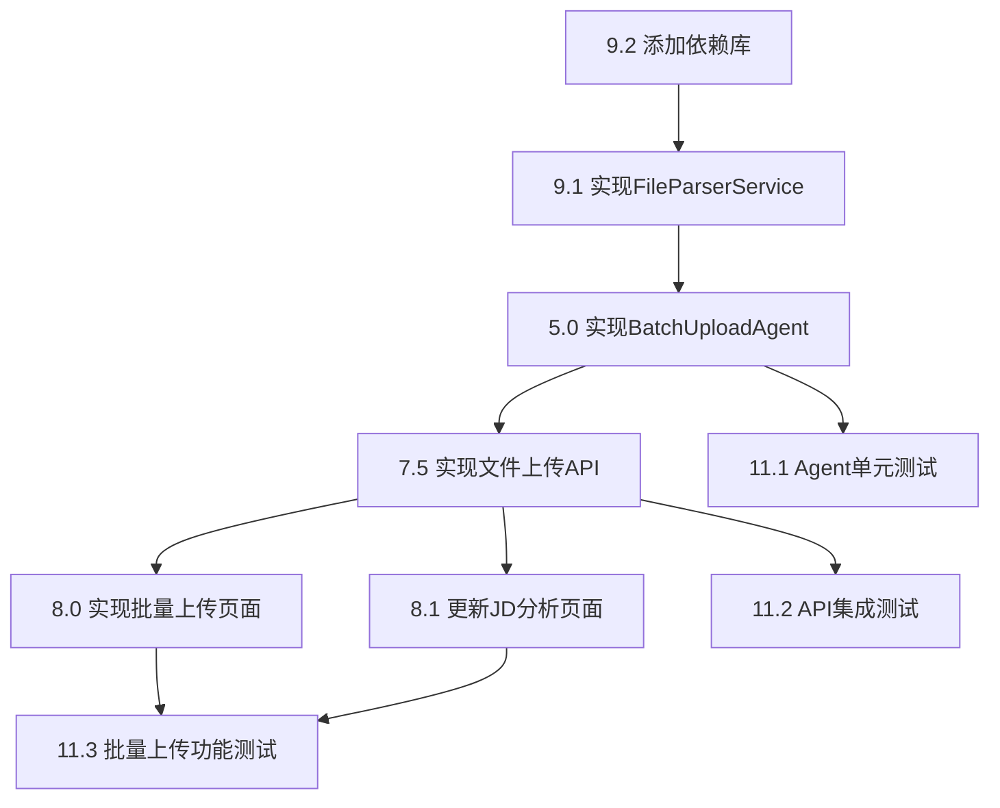

# 批量上传岗位JD附件功能 - 任务列表更新

## 更新日期
2024-01-13

## 概述
为实施批量上传岗位JD附件功能，在任务列表中添加了相关的实施任务，涵盖Agent开发、文件解析、API实现、前端界面和测试等各个方面。

## 新增任务

### 1. 核心Agent实现（任务5）

#### 5.0 实现批量上传Agent（BatchUploadAgent）
**优先级：高**

**子任务：**
- [ ] 实现文件验证逻辑（格式、大小、数量）
- [ ] 实现批量文件处理循环
- [ ] 实现进度通知机制（via MCP）
- [ ] 实现与Parser Agent和Evaluator Agent的协调
- [ ] 实现批量处理上下文管理
- [ ] 实现结果汇总和错误处理

**关联需求：** 1.16, 1.17, 1.18, 1.19, 1.20, 1.21, 1.22, 6.1, 6.2, 6.3, 6.8

**技术要点：**
- 继承MCPAgent基类
- 注册"batch_upload"和"parse_file"消息处理器
- 使用FileParserService进行文件解析
- 通过MCP与其他Agent通讯
- 管理批量处理的共享上下文

**预计工时：** 2-3天

---

### 2. 文件解析和批量处理功能（任务9）

#### 9.1 实现文件解析服务（FileParserService）
**优先级：高**

**子任务：**
- [ ] 实现TXT文件解析（支持UTF-8、GBK、GB2312等编码）
- [ ] 实现PDF文档解析（使用PyPDF2）
- [ ] 实现DOCX文档解析（使用python-docx）
- [ ] 实现DOC文档解析（使用textract，可选）
- [ ] 实现文件格式自动识别
- [ ] 实现文件验证（大小、格式）
- [ ] 实现批量验证（数量、总大小）

**关联需求：** 1.16, 1.17, 1.18, 1.19, 1.20

**技术要点：**
- 创建`src/utils/file_parser.py`
- 实现多编码自动识别
- 处理文件解析异常
- 定义验证规则常量

**预计工时：** 1-2天

#### 9.2 添加文件解析依赖库
**优先级：高**

**子任务：**
- [ ] 添加PyPDF2到requirements.txt
- [ ] 添加python-docx到requirements.txt
- [ ] 添加python-magic到requirements.txt（文件类型检测）
- [ ] 可选：添加textract到requirements.txt

**关联需求：** 1.16, 1.17

**依赖版本：**
```txt
PyPDF2==3.0.1
python-docx==1.1.0
python-magic==0.4.27
textract==1.6.5  # 可选
```

**预计工时：** 0.5天

---

### 3. FastAPI后端实现（任务7）

#### 7.5 实现文件上传和批量处理API端点（更新）
**优先级：高**

**新增端点：**
- [ ] POST /api/v1/jd/upload - 单个文件上传并分析
- [ ] POST /api/v1/jd/batch-upload - 批量文件上传（最多20个）
- [ ] GET /api/v1/batch/status/{batch_id} - 查询批量处理状态
- [ ] GET /api/v1/batch/results/{batch_id} - 获取批量处理结果

**保留端点：**
- [ ] POST /api/v1/batch/analyze - 批量分析JD文本
- [ ] POST /api/v1/batch/match - 批量匹配候选人

**关联需求：** 1.16, 1.17, 1.18, 1.19, 1.20, 1.21, 1.22, 6.1, 6.2, 6.3, 6.4, 6.5, 6.8

**技术要点：**
- 使用FastAPI的UploadFile处理文件上传
- 实现multipart/form-data解析
- 通过MCP发送消息给BatchUploadAgent
- 实现异步文件处理
- 返回batch_id用于状态查询

**预计工时：** 2-3天

---

### 4. Streamlit前端实现（任务8）

#### 8.0 实现批量上传页面
**优先级：高**

**子任务：**
- [ ] 文件上传组件（支持多选，最多20个文件）
- [ ] 文件列表预览（显示文件名、大小、格式）
- [ ] 上传进度条和实时状态更新
- [ ] 批量处理结果汇总展示
- [ ] 成功/失败文件列表展示
- [ ] 每个JD的快速预览（职位标题、质量分数）
- [ ] 错误信息展示和重试功能

**关联需求：** 1.16, 1.17, 1.18, 1.19, 1.20, 1.21, 1.22, 6.1, 6.2, 6.3

**UI组件：**
```python
# 使用Streamlit组件
st.file_uploader("上传JD文件", accept_multiple_files=True)
st.progress(progress_value)
st.success(f"成功: {success_count}")
st.error(f"失败: {failed_count}")
st.dataframe(results_df)
```

**预计工时：** 2-3天

#### 8.1 实现JD分析页面（更新）
**优先级：高**

**新增功能：**
- [ ] 单个文件上传功能

**保留功能：**
- JD文本输入区域
- 评估模型选择
- 分析结果展示
- 职位分类展示
- 手动调整分类功能

**关联需求：** 1.1-1.5, 1.9-1.12, 1.16, 1.17, 2.1-2.5, 3.1-3.5

**预计工时：** 1天（增量开发）

---

### 5. 测试和优化（任务11）

#### 11.1 编写Agent单元测试（更新）
**优先级：中**

**新增测试：**
- [ ] 测试BatchUploadAgent的文件处理逻辑
- [ ] 测试FileParserService的各格式解析

**保留测试：**
- 测试每个Agent的核心功能
- 使用Mock LLM进行测试

**预计工时：** 1-2天

#### 11.2 编写API集成测试（更新）
**优先级：中**

**新增测试：**
- [ ] 测试文件上传端点（单个和批量）
- [ ] 测试批量处理工作流完整性
- [ ] 测试文件格式验证和错误处理

**保留测试：**
- 测试所有API端点

**预计工时：** 1-2天

#### 11.3 编写批量上传功能测试（新增）
**优先级：中**

**测试场景：**
- [ ] 测试单个文件上传（TXT、PDF、DOCX）
- [ ] 测试批量上传5个文件
- [ ] 测试批量上传20个文件（边界测试）
- [ ] 测试上传超过20个文件（应拒绝）
- [ ] 测试上传不支持格式（应提示错误）
- [ ] 测试上传超大文件（应拒绝）
- [ ] 测试上传损坏文件（应跳过）
- [ ] 测试并发批量上传

**关联需求：** 1.16, 1.17, 1.18, 1.19, 1.20, 1.21, 1.22

**测试工具：**
- pytest
- pytest-asyncio
- httpx（API测试）
- 测试文件样本（各种格式）

**预计工时：** 2-3天

#### 11.4 性能优化（更新）
**优先级：低**

**新增优化：**
- [ ] 批量文件处理并行化优化
- [ ] 文件解析性能优化

**保留优化：**
- LLM调用优化
- 缓存策略优化
- 数据库查询优化

**预计工时：** 1-2天

---

## 任务依赖关系



## 实施顺序建议

### 第一阶段：基础设施（1-2天）
1. **9.2** 添加文件解析依赖库
2. **9.1** 实现FileParserService

### 第二阶段：后端开发（3-4天）
3. **5.0** 实现BatchUploadAgent
4. **7.5** 实现文件上传和批量处理API端点

### 第三阶段：前端开发（2-3天）
5. **8.0** 实现批量上传页面
6. **8.1** 更新JD分析页面（添加单文件上传）

### 第四阶段：测试和优化（3-4天）
7. **11.1** 编写Agent单元测试（BatchUploadAgent部分）
8. **11.2** 编写API集成测试（文件上传部分）
9. **11.3** 编写批量上传功能测试
10. **11.4** 性能优化（批量处理部分）

**总预计工时：** 9-13天

## 关键里程碑

### 里程碑1：文件解析能力就绪
- ✅ 依赖库安装完成
- ✅ FileParserService实现并测试通过
- ✅ 支持TXT、PDF、DOCX格式

**验收标准：**
- 能够成功解析各种格式的JD文件
- 文件验证逻辑正常工作
- 单元测试覆盖率 > 80%

### 里程碑2：批量上传后端完成
- ✅ BatchUploadAgent实现完成
- ✅ 文件上传API端点可用
- ✅ MCP消息流正常工作

**验收标准：**
- 能够处理单个和批量文件上传
- 进度通知正常发送
- 错误处理机制完善
- API集成测试通过

### 里程碑3：批量上传前端完成
- ✅ 批量上传页面可用
- ✅ 进度显示正常
- ✅ 结果展示清晰

**验收标准：**
- 用户能够上传最多20个文件
- 实时显示处理进度
- 成功/失败结果清晰展示
- 用户体验流畅

### 里程碑4：功能测试完成
- ✅ 所有测试场景通过
- ✅ 性能满足要求
- ✅ 文档完善

**验收标准：**
- 功能测试覆盖率 > 90%
- 单个文件处理时间 < 5秒
- 批量20个文件处理时间 < 2分钟
- 用户文档和API文档完整

## 风险和缓解措施

### 风险1：文件解析失败率高
**影响：** 高
**概率：** 中
**缓解措施：**
- 提供多种编码支持
- 实现健壮的错误处理
- 提供文件预检功能
- 给用户清晰的错误提示

### 风险2：批量处理性能不足
**影响：** 中
**概率：** 中
**缓解措施：**
- 实现并行处理
- 优化LLM调用
- 添加处理队列
- 限制并发数量

### 风险3：文件上传安全问题
**影响：** 高
**概率：** 低
**缓解措施：**
- 严格的文件类型验证
- 文件大小限制
- 病毒扫描（可选）
- 用户隔离存储

### 风险4：用户体验不佳
**影响：** 中
**概率：** 低
**缓解措施：**
- 实时进度反馈
- 清晰的错误提示
- 支持重试功能
- 提供使用指南

## 成功标准

### 功能完整性
- ✅ 支持TXT、PDF、DOCX三种格式
- ✅ 支持批量上传最多20个文件
- ✅ 实时显示处理进度
- ✅ 清晰展示成功/失败结果
- ✅ 完善的错误处理

### 性能指标
- ✅ 单个文件解析时间 < 5秒
- ✅ 批量20个文件处理时间 < 2分钟
- ✅ 文件解析成功率 > 95%
- ✅ 系统响应时间 < 1秒

### 用户体验
- ✅ 操作流程简单直观
- ✅ 进度反馈及时准确
- ✅ 错误提示清晰有用
- ✅ 支持常见使用场景

### 代码质量
- ✅ 单元测试覆盖率 > 80%
- ✅ 集成测试覆盖率 > 90%
- ✅ 代码符合PEP8规范
- ✅ 文档完整清晰

## 总结

批量上传岗位JD附件功能的任务已全面规划，涵盖了从基础设施到测试优化的完整开发周期。通过分阶段实施，可以确保功能的稳定性和可维护性。预计总工时9-13天，可以在2周内完成全部开发和测试工作。

该功能将显著提升系统的实用性，减少用户的手动操作，提高工作效率，是系统走向企业级应用的重要一步。
